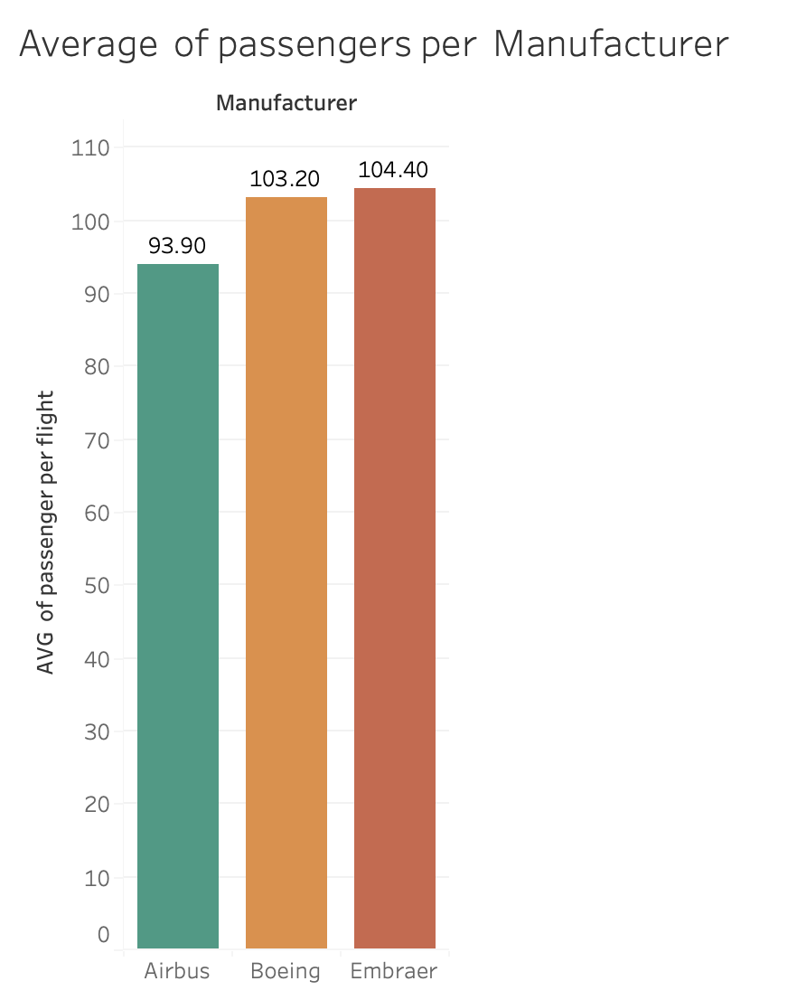

# Aircraft Manufacturer Analysis

## Objective

The initial objective of this project was to calculate the average number of passengers on Boeing flights, considering only aircraft with a capacity greater than 200 passengers.

This analysis was developed using SQL, working with three datasets:
- `ba_aircraft`: Aircraft details.
- `ba_flights`: Flight data.
- `ba_fuel_efficiency`: Aircraft capacity and fuel efficiency.

---

## How It Works

1. Join the datasets based on the aircraft and flight information.
2. Filter only aircraft with capacity greater than 200 seats.
3. Calculate the average number of passengers per flight.
4. Expand the analysis to compare all manufacturers.

---

## Tables Used

| Table               | Description                         |
|--------------------|-------------------------------------|
| `ba_aircraft`      | Aircraft details and manufacturer.  |
| `ba_flights`       | Flight information and passengers.  |
| `ba_fuel_efficiency`| Aircraft capacity and efficiency.  |

---

## Final Query

The complete SQL script is available in: `/query/queries.sql`

---

## Visual Analysis

> The chart was developed using Tableau.

---

## Final Considerations

Although the initial exercise required calculating the average number of passengers only for Boeing aircraft, I chose to expand the analysis to compare other manufacturers as well.

This approach adds more value to the project by providing a richer and more comprehensive analysis.

The results showed that Boeing and Embraer have the highest average number of passengers per flight, considering aircraft with a capacity greater than 200 seats.

